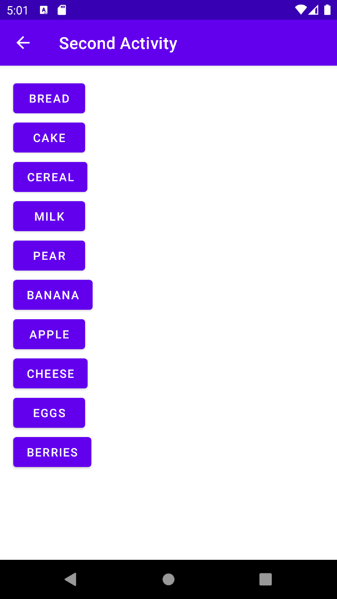
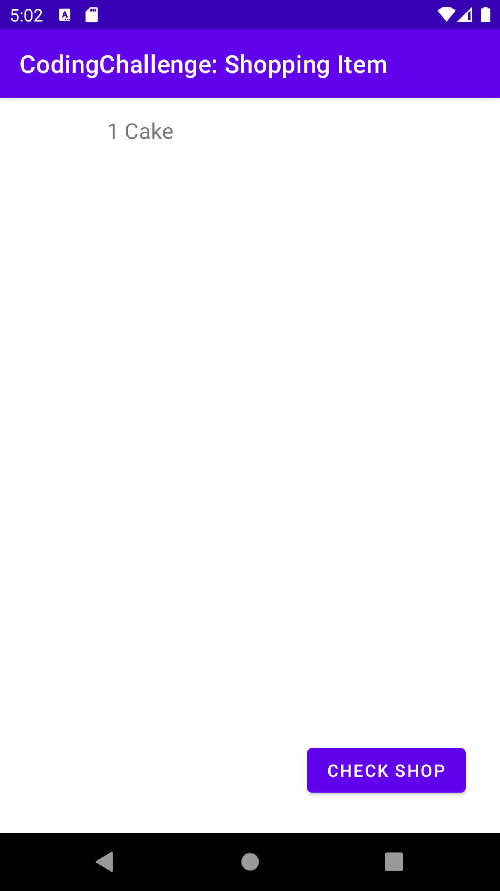
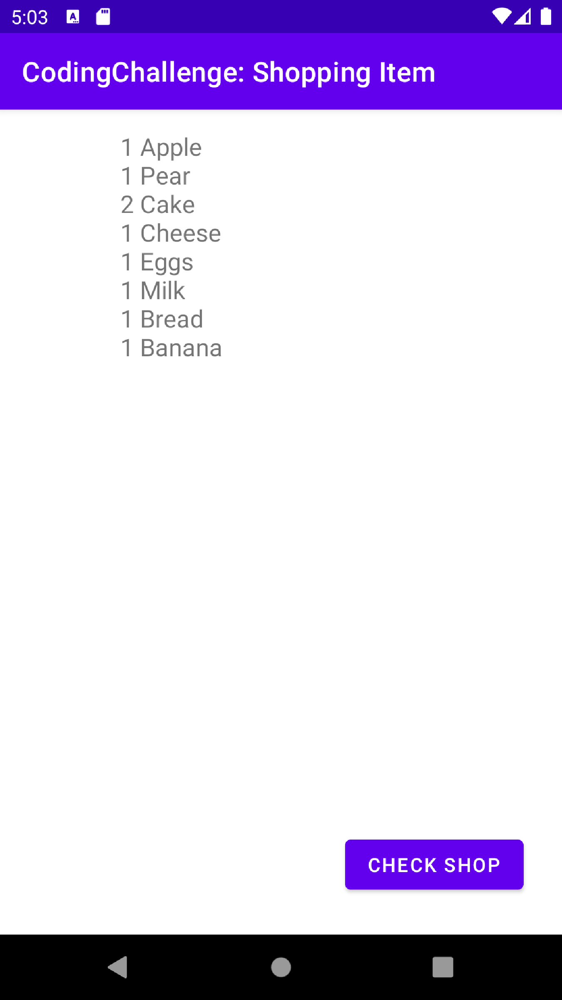
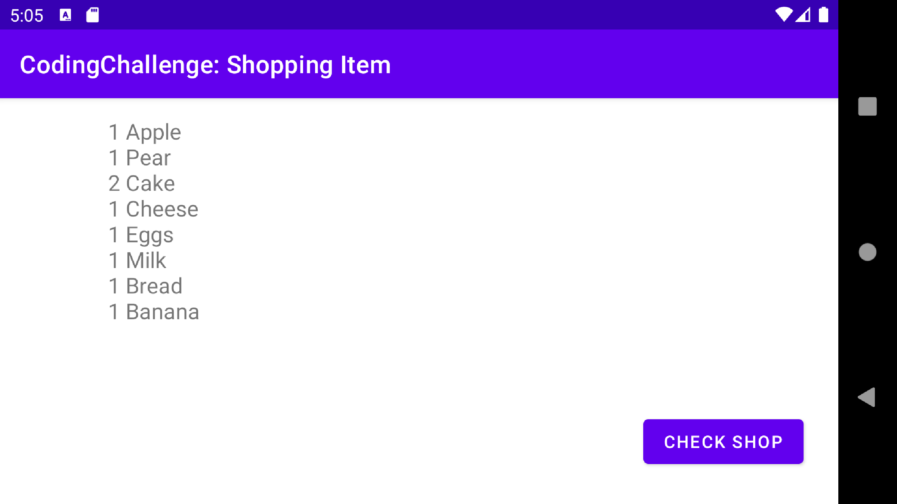

# Shopping List Coding Challenge

###  Shop main page to check the item user have to click check shop.

### List of shopping item are displayed here.

### If you select item from second activity then it will listed in a main Activity.

### If you double click those shopping item it will count its initial values.

### Similarly you can add list item in main activity.

### If user rotate their screen their devices there will not be value destroy.

