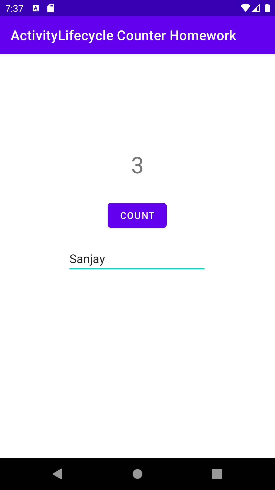

# Activity life Cycle and State (HomeWork)
- The Button count handle the click event while clicking button.
- User can add their name into the Edit Text bar.
- After adding count value and add text name into the user Interface.
- when user rotate their screen those value save Instance state.
## app OverView

## Vertical

## Horizontal
