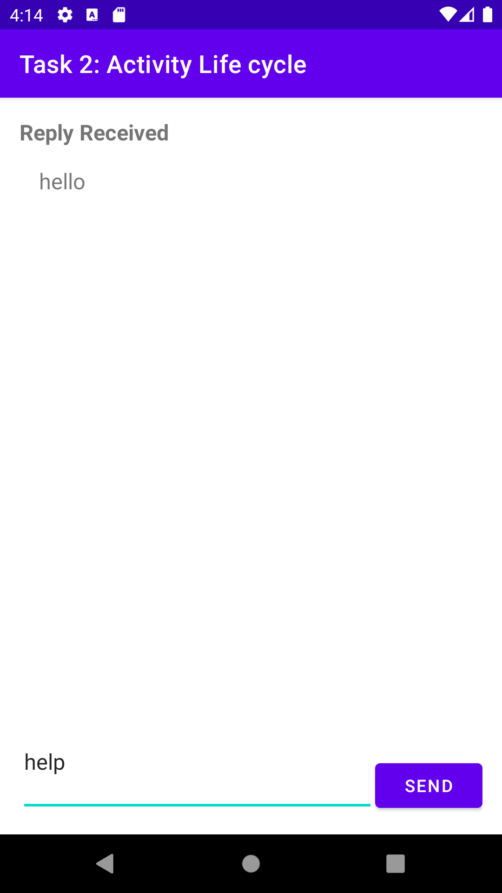

# Activity LifeCycle and State
## Task 1 Add lifeCycle callbacks to two activity.
- In this project i have copied the Activity and Intent project.
- Implement the call backs into Main Activity.
- On the oncreate() method, I have added the log statement.
- All call back method have same signature.
- onCreate(), onStart(), onPause(), onRestart(), onResume(), onStop(), onDistroy().
- ALl of these content call the right method in the super class.
- In all method there are Log tag which show log for the event.
- Implement lifeCycle callbacks in SecondActivity.
- At the top of the class, there is constant for log_tag variable.
- Adding callbacks and log statement into SecondActivity.
### LifeCycle Methods

## Task 2 Save and restore the Activity Instance.
- Save the Activity Instance state with onSaveInstanceState method.
- The header is visible, then there is reply data that needs to be saved.
- The actual text of the message goes into the state Bundle with the key "reply_text".
- Restore the activity instance state in onCreate method.
- When Activity is created, the system passes the state Bundle to onCreate() as its only argument.
- Get the text reply message from the Bundle with the key "reply_text", and set the reply TextView to show that string.
- In this task your text messages and text reply are visible while rotating the screen.

### Messages are visible while rotating the Screen.
- Vertical

-horizontal

